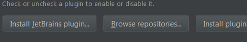
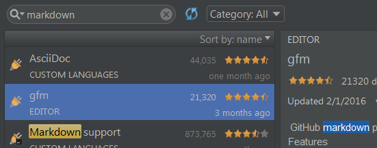
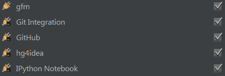

# Installation Notes

Before getting started you will need to install Python, PyCharm and a few plugins to get your started.

## Installing Python

For the majority of the workshops (and beyond), it would be best to install the full Python distribution called [Anaconda](https://www.continuum.io/downloads).  It will include the majority of libraries you will need to do scientific computing, math and others.  If for some reason Anaconda fails to install, a vanilla Python 2.7.11 ([Win or OSX Download here](https://www.python.org/downloads/release/python-2711/)) will do.

Things to remember:
* use the 64bit Python 2.7.11 version of the installation
* the installation will take some time, so try not to interrupt it as it is working

## Installing PyCharm
While there are a ton of editors out there for working with Python, I have come to enjoy PyCharm and will introduce it to you in hopes that you too might decide to continue using it past these workshops.  There are _many_ other really good editors, so feel free to shop around.

Installing PyCharm should be a breeze and it works on either the Mac or PC platforms:

* Go to [Pycharm Community Edition](https://www.jetbrains.com/pycharm/download) and download the edition for your machine.

### PyCharm Cheatsheet
PyCharm _as an editor_ is pretty basic, but there are a lot of extras you will want to know about.  The best place to start is with Keyboard shortcuts and [this guide](https://resources.jetbrains.com/assets/products/pycharm/PyCharm_ReferenceCard.pdf) will give you everything you need in one nice PDF.  Bookmark/save this file as  you might use it over and over well after this workshop until these commands are ingrained in your soul (should you be brave enough to stick with PyCharm).

### Plugins and other stuff
After you have installed PyCharm, you can poke around and play with the functionality a bit, but off the bat you will should install a plugin that will be very useful for writing Markdown (more on this later).

Go into the `File->Settings->Plugins` and click the ``"Browse Repositories..."`` button toward the middle of the popup dialog.

In the ``"search"`` box type ``"markdown"`` as shown:

Choose the ``"gfm"`` plugin and click the ``"Install"` button that pops up.

After the installation, you'll be prompted to restart PyCharm.  Do that.

Now go back to the `File->Settings->Plugins` and check to see `gfm` is installed -- your screen should look something like this:

